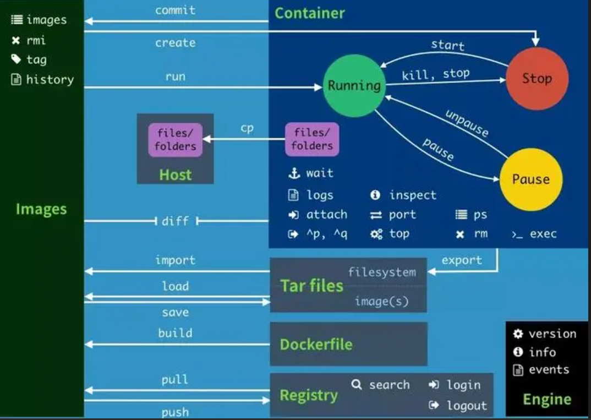

# Docker容器基础操作

## A.概述

Docker 是一个开源的应用容器引擎，让开发者可以打包他们的应用以及依赖包到一个可移植的容器中,然后发布到任何流行的[Linux](https://baike.baidu.com/item/Linux?fromModule=lemma_inlink)或Windows操作系统的机器上,也可以实现虚拟化,容器是完全使用沙箱机制,相互之间不会有任何接口。关于docker，命令行的大部分操作，参见下图以及后文描述。



------

## B.命令行操作

### B-1    Image

#### 		Search 找镜象

```shell
# 找一个dockerhub中的镜像。作为将来的容器工作基础环境。
docker search centos
```

#### 		Pull 拉取镜像

```shell
# 对中意的镜像进行下载,可用冒号指定版本。默认下载 Lastest  
docker pull centos 
docker pull mysql:5.7
```

#### 		Images 查看镜像

```shell
# 查看自己下载好的镜像
docker image 
或
docker images 

当使用images时，常用的附加参数： -q -a  展示所有image的镜像号  

docker images -qa 

```

#### 		Tag 镜像标签

```shell
# 为一个镜像创建副本，并打上个性化标签
format: docker tag  srcimg[tag] newimg[tag]
docker tag centos   centos:114514
docker tag centos114514   centos:886

# 验证：多了 "114514" 和 "886" 的centos镜像
REPOSITORY          TAG                 IMAGE ID            CREATED             SIZE
docker.io/mysql     5.7                 9ec14ca3fec4        2 days ago          455 MB
centos              114514              5d0da3dc9764        16 months ago       231 MB
docker.io/centos    latest              5d0da3dc9764        16 months ago       231 MB
# 注： 副本的id和src id相同。
```

#### 		Rmi 删除镜像

```shell
# 删掉一个不顺眼的镜像
docker rmi centos[tag]
或
docker rmi imageID

注：images id 相同的镜像删不掉，只要name[tag]的方式删。

# 常用的组合技,依据镜像号干掉所有。
docker rmi $(docker images -qa)
# 注：rmi 不具备原子性，以上命令会将可删的全干掉，剩下id重复的。
```

#### 		Save 导出镜像包

```shell
# 把某镜像打成一个可物理移动的包
docker save image[tag] -o /dest_path/dest.tar

# 注，此包本质是压缩文件。
file centos.886 
centos.886: POSIX tar archive
```

#### 		Load 载入镜像包

```shell
# 把一个物理包解入本地 images 仓里
docker load -i  /src_path/src.tar
```

### B-2 container

#### 		Run 生成容器

```shell
# 用image作为母版生成容器
docker run -d -it   --name "niyeye_centos" -p 45673:22 -p 80:80   centos:886 bash 
# 参数解释：
-d 后台运行，即执行后不会蹦到控制台
-it 以可交互的形式运行，若不指定这个或者其他的什么命令，容器启动后无事可做就会很快退出。
--name 给你的业务之光起个名字
-p  端口映射，格式： 宿主机port:容器内部port
-P  随机端口映射
cetos:886  基准镜像名，建议跟在一堆参数后面。
bash 与 -it 配合使用，指定交互用的解释器是啥 
```

#### 		Port 容器端口映射

```shell
# 容器端口映射
# -p  端口映射，格式： -p 宿主机port:容器内部port
# -P  随机端口映射 格式： -P 要映射的容器内port
docker run -d -it   --name "niyeye_centos" -p 45673:22 -p 80:80   centos:886 bash 
```

#### 		Stop 停止容器

```shell
# 如你所想，停掉一个运行中的容器，使之躺好等待下次召唤。
docker stop  containerID
或
docker stop containerName
# 注：聪明的你一定发现了，不管是镜像还是容器，使用证明他们唯一性的name[tag]或 ID号 都可以对其进行调动。
```

#### 		Star 启动容器

```shell
# 启动一个停止状态的容器，启动方式取决于容器创建时被设定的参数。比如 -d -it 等等
docker start  -i containerName
# 参数说明
-i 是以交互方式启动容器；便利之处在于，如果你要想对这个刚起来的容器做点什么，这个参数可以帮你省下了敲 attach 的力气。
# 看实际需求加，不加也没什么事。
```

#### 		Exec 新窗口容器交互

```shell
# 以一个新窗口进入容器内交互；如果你执行过 start -i 之后，会得到一个经验: 如果想退出容器，直接exit，容器本身也会停掉，因为就一个交互窗口支撑容器运行，一旦停止，无事可做的容器会歇逼。
# 这个命令避免了以上的情况，聪明的你一定想到了，那就是使用多开交互窗口的形式避免exit指令影响到那个真身。

docker exec -it containerName /bin/bash

# 参数说明：
-it 聪明的你一定想到了，和run 指令同名参数的一摸一样
exit 进入容器后使用exit 或者 ctrl ^d 退出
```

#### 		Attach  本体窗口交互

```shell
# 使用唯一的本体进入交互式操作
docker attach containerName 
# 参数说明
exit 进入容器后使用exit，聪明的你一定注意到了，如果attach中使用exit后，容器真的会歇逼。
ctrl ^P ^Q  退出容器且不让他歇逼的组合键。
```

#### 		Logs 容器日志

```shell
# 检查容器运行日志，活着能看，歇逼的也能看
docker logs -ft  --tail Number containerName
# 参数说明
-ft  一般这俩集合使用，现实日志细节
--tail Number 动态刷，且规定刷新几行；聪明的你又想到了，没错，和tail -f 命令的尿性一摸一样。
```

#### 		Kill 强制终止容器

```shell
# 当你气急败坏的想干掉每个容器时，残暴无情的。
docker kill containerName 
```

#### 		PS 检查容器运行状态

```bash
# 谁在坐牢，谁在歇逼
docker ps 
docker  ps -qa
# 参数说明
-q  聪明的你又猜对了，只显示containerID
-a  聪明的你又猜对了，显示所有 all 
-n=num  显示最近创的num个容器
# 注： 不加参数，看不到歇逼的容器。
```

#### 		TOP 检查容器内部进程	

```shell
# 聪明の你··· 这个和top 命令相似哦，只不过是非交互批命令式。
docker top containerName
```

#### 		inspect 容器源数据检查

```shell
# 略长，涵盖容器的所有信息，底裤都被聪明的你看光了。
docker inspect containerName
```

#### 		Rm 删除容器

```shell
# 聪明の你又猜对了，和上面镜像管理的rmi 命令一样.
docker rm containerName 

# 常用的组合技,依据镜像号干掉所有。
docker rm $(docker ps  -qa)
```

#### 		CP 容器文件拷贝

```shell
# 打破第四堵墙，容器文件
Usage:  docker cp [OPTIONS] CONTAINER:SRC_PATH DEST_PATH      # 容器里往外面拷
        docker cp [OPTIONS] SRC_PATH|- CONTAINER:DEST_PATH    # 宿主机往容器里拷
 # 参数以及讲解。(直接偷懒，我认为我们还是学简单看洋文手册，省下一些在csdn淘垃圾的时间)
 -a 参数 压缩模式
 -L 为源文件创建符号链接
```

#### 		volume 挂卷

```shell
# 持久化的，把容器数据给宿主机一份
# 一般 配合 run 命令使用
# 也可以绕个弯，先commit一个副本，Run这个副本image 附加上 -v 参数，实现某种意义的追加。
# 追加的话比较麻烦：可以去修改 某容器的核心配置json，最后重新启动docker服务实现追加。

示例： 
docker run -d --name=xxx -it -v 宿主路径1:容器路径2 -v 宿主路径2:容器路径2  ImageName  bash
# 参数说明
-v 就是挂卷的参数，使用也不复杂；可指定多个。


# 容器间数据卷复制
# --volume from  
docker run -d --name=father -it -v 宿主路径1:容器路径2 -v 宿主路径2:容器路径2  ImageName  bash
docker run -d -it --name=son -it --volumes-from father  imageName
# 以上两个案例，先创建一个挂了卷的father，后面创建一个son 使用参数 --volumes-from 共享了father的挂载卷。
# 注： --volunmes-from 分享出来的数据是三分，编辑删除的操作会辐射到其他挂载点。但是删除某容器不会，例如，当我删除了father之后，son内的挂在卷不会收到影响。
```

#### 		Commit 容器打包成镜像

```shell
# 把自己把玩了半天的容器达成镜像有什么好处呢？好比说玩游戏到了一个线路选择的节点上，我存了一个档。
# 把正在运行的容器，连同容器当前的运行环境；打成一个基础的镜像供以后调用。<自定义镜像吧>
docker commit -a "auther" -m "message"  Src_containerName dest_imageName
# 参数说明
-a 标注作者 
-m 标注备注
```

#### 	DockerFile 通过构建脚本来生成自定义镜像

##### 		构建命令关键词

```bash
# 构建关键字必须是大写字母、执行顺序从行首到行尾、每一行都是在构建过程中都是一层。
# 如果把dockerfile类比shell脚本，那么每个关键字都是一个指令。写一个脚本需要熟悉指令，并分析需求写出相应的构建脚本。

# 常用的关键字
关键字			 参数						参数说明
FROM  			base_image  			基础镜像
MAINTAINER  	 auther					作者信息
RUN				command     			构建时运行的命令
ADD				./Hostsrcfile  /DestFile 从dockerfile所在目录下拷点东西进容器	
WORKDIR			/workpath   			容器起来第一工作目录（容器内路径），可指定多次。
VOLUME			/volumepath 			给容器分一个挂载卷，挂载后观察容器的 / ，有对应卷名的目录。
EXPOSE			port				    容器开的端口，如需映射，需要run的时候加 -P参数
CMD				command  				run起来的时候的指令 【可替换】
ENTRYPOINT		 command     			 run起来的时候的指令 【可追加】
ONBUILD			 command 				当这个镜像被作为基础构建时，触发的指令。
COPY			./Hostsrcfile  /DestFile  从dockerfile所在目录下拷点东西进容器
ENV				ENVNAME=woshinidie  	 定义一个环境变狼
```

##### 	构建示例文件

```docker
# 需求，基于centos镜像，考进两个文件，设定一个java环境变量，开放一个80端口，设指定的工作目录
# 文件结构：共11层，11个命令。

FROM base_c7					# base镜像是我的本地自制的一个换完源的centos
MAINTAINER huken@163.com		 # 标注了作者信息
RUN  yum -y install vim && mkdir /usr/local/java_1.8.0/ 	# 构建时运行的命令，我需要这个镜像构建好时，装好vim软件。
ADD     2.sh /opt/				# 将dockerfile 当前文件的东西 考进容器的某路径下
COPY   1.sh  /opt/1.sh			# 将dockerfile 当前文件的东西 考进容器的某路径下
EXPOSE  80					   # 容器内开放的端口 需要容器内部开放一个端口 
ENV    JAVA_HOME=/usr/local/java_1.8.0/		# 设定一个环境变量
WORKDIR  /root/nidie			# 交互式登入容器时的落地目录 
VOLUME   ["volume1","volume2"]	 # 挂两个卷
ONBUILD  echo "by NIDIE"		# 当这个镜像被作为基础构建时，也就是当被FROM时，触发的指令。
CMD      echo "by NIDIE"		# run时运行的命令
```

##### 构建指令

```shell
docker build -f dockerFile -t DestImageName[tag] .
# 参数说明
-f 指定一个dockerfile 文件
-t 要构建的镜像包名以及tag
 .  当前路径下找dockerfile文件及其所需文件，少了路径会报错
```


### B-3  docker 网络

```bash
# docker 的默认网桥，容器互相ping不通，但允许创一个自定义docker网络
# 创建
# 需求：创建一个名为 netName 的网桥，网域为 172.168.0.0/16 网点为 172.168.0.1
docker network create --driver bridge --subnet 172.168.0.0/16 --gateway 172.168.0.1 netName

# 使用：Run的时候指定网络 
# -net 
docker run -d -it -net netName  --name="niyeye" imageName 

# 打通某容器对某网域的通道 [解决不同网段的容器通信]
# docker network connect 
docker network connect  netName containerName
此时 containerName 的容器 就可以与 netName网段的容器通信了。
```


## C. docker数据 扩容&迁移&备份

#### 	C1 扩容&迁移

​		用mv 和 软连接的方式扩容

```shell
1. 检查docker 数据路径
docker info | grep "Docker Root Dir"
Docker Root Dir: /var/lib/docker 
2. 扩容,先把数据转移到新地方，再软链到docker原来的存储路径；如果使用cp 命令的话加上p参数，保留文件原来权限。
systemctl stop docker 

mv  /var/lib/docker/*  /data/docker_data
rm -rf /var/lib/docker/
ln -sf /data/docker_data   /var/lib/docker

systemctl start docker

3.检验 docker images 和docker ps -a 是否数据存在。
```

#### C2 备份

```shell
# 直接对 docker root dir 的文件做备份即可。
# 归档指令参考
tar -cvzf  xxx.tgz   Destfile
```

